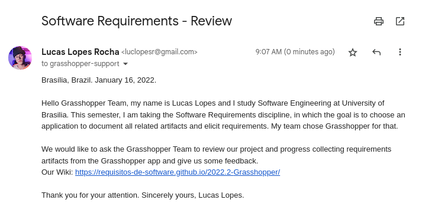

# Comprovação Informal

## Introdução

Comprovação informal é um método de validação de requisitos em que é basicamente uma tarefa de leitura  de descrições em linguagem natural e do uso de clientes para identificar problemas na expressão dos requisitos.

## Metodologia

Como forma de validação, foi entrado em contato com o Grasshopper pelo e-mail 	<i>grasshopper-support@google.com</i>, onde foi contextualizado a situação e pedido para que o time de desenvolvimento nos dê retorno sobre os requisitos elicitados e todos os outros artefatos.

## Comprovação Informal

A <i>Figura 1</i> mostra o e-mail utilizado para entrar em contato com o time Grasshopper e pedir pela comprovação informal.

<figcaption align="center">Figura 1: E-mail enviado. (Fonte: Autores, 2022)</figcaption>

## Conclusão

Até o momento, não houve retorno.

## Histórico de versão
| Versão | Data | Descrição | Autor | Revisor |
| :----: | :--: | :-------: | :---: | :-----: |
| 1.0 | 16/01/2023 | Criação e desenvolvimento da página | Lucas Lopes | Wildemberg Sales |