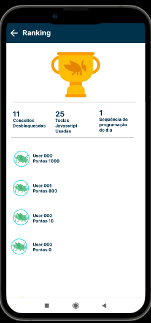

# Forward-from

## Introdução

Neste documento busca-se construir a matriz de pós-rastreabilidade através da ótica forward-from (para frente, a partir de), etapa da rastreabilidade que liga requisitos a artefatos de desenho e implementação.

## Metodologia

A partir dos requisitos padronizados dentro do <a href="https://requisitos-de-software.github.io/2022.2-Grasshopper/modelagem/modelagemAgil/backlog/">Backlog</a>, foi feita a rastreablidade dos mesmos, buscando informar seu épico, feature, história de usuário e seus critérios de aceitação, além de informar se o requisito foi implementado ou não junto à uma imagem de demonstração.

A <i>Tabela 1</i> mostra o modelo padrão que será utilizado nesse artefato como padronização do processo.

**Legenda:**

- RF: Requisito Funcional
- RNF: Requisito Não-Funcional
- EP: Épico
- FT: Feature
- US: Histório de Usuário

| RFXX                       | <i>Descrição do requisito.</i>                                                   |
| -------------------------- | -------------------------------------------------------------------------------- |
| **Épico**                  | <i>ID do épico que o requisito está envolvido.</i>                               |
| **Feature**                | <i>ID da feature que o requisito está envolvido.</i>                             |
| **US**                     | <i>ID da história de usuário que o requisito está envolvido.</i>                 |
| **Critérios de Aceitação** | <i>ID da história de usuário que contém os critérios.</i>                        |
| **Implementação**          | <i>Informa se é um "Requisito implementado" ou "Requisito não implementado".</i> |
| **Demonstração**           | <i>Imagem da funcionalidade, caso tenha sido implementada.</i>                   |

<figcaption align="center">Tabela 1: Modelo padrão da pós-rastreabilidade. (Fonte: Autores, 2022)</figcaption>

## Requisitos

## 
As tabelas a seguir contém a rastreabilidade dos requisitos funcionais elicitados.

| RF01                       | Deve ser possível efetuar login/cadastro com Google.                                                                                                               |
| -------------------------- | ------------------------------------------------------------------------------------------------------------------------------------------------------------------ |
| **Épico**                  | <a href="https://requisitos-de-software.github.io/2022.2-Grasshopper/modelagem/modelagemAgil/backlog/#epico-01-conta">EP01</a>                                     |
| **Feature**                | <a href="https://requisitos-de-software.github.io/2022.2-Grasshopper/modelagem/modelagemAgil/backlog/#epico-01-conta">FT01</a>                                     |
| **US**                     | <a href="https://requisitos-de-software.github.io/2022.2-Grasshopper/modelagem/modelagemAgil/historias-de-usuario/#us01-efetuar-logincadastro-com-google">US01</a> |
| **Critérios de Aceitação** | <a href="https://requisitos-de-software.github.io/2022.2-Grasshopper/modelagem/modelagemAgil/historias-de-usuario/#us01-efetuar-logincadastro-com-google">US01</a> |
| **Implementação**          | Requisito implementado.                                                                                                                                            |
| **Demonstração**           |                                                                                              |

<figcaption align="center">Tabela 2: Pós-rastreabilidade do RF01. (Fonte: Autores, 2022)</figcaption>

---

| RF02                       | Deve ser possível sair da conta, caso esteja logada.                                                                                            |
| -------------------------- | ----------------------------------------------------------------------------------------------------------------------------------------------- |
| **Épico**                  | <a href="https://requisitos-de-software.github.io/2022.2-Grasshopper/modelagem/modelagemAgil/backlog/#epico-01-conta">EP01</a>                  |
| **Feature**                | <a href="https://requisitos-de-software.github.io/2022.2-Grasshopper/modelagem/modelagemAgil/backlog/#epico-01-conta">FT02</a>                  |
| **US**                     | <a href="https://requisitos-de-software.github.io/2022.2-Grasshopper/modelagem/modelagemAgil/historias-de-usuario/#us08-sair-da-conta">US08</a> |
| **Critérios de Aceitação** | <a href="https://requisitos-de-software.github.io/2022.2-Grasshopper/modelagem/modelagemAgil/historias-de-usuario/#us08-sair-da-conta">US08</a> |
| **Implementação**          | Requisito implementado.                                                                                                                         |
| **Demonstração**           |                                                                           |

<figcaption align="center">Tabela 3: Pós-rastreabilidade do RF02. (Fonte: Autores, 2022)</figcaption>

---

| RF03                       | Deve ser possível excluir conta, caso esteja logada.                                                                                            |
| -------------------------- | ----------------------------------------------------------------------------------------------------------------------------------------------- |
| **Épico**                  | <a href="https://requisitos-de-software.github.io/2022.2-Grasshopper/modelagem/modelagemAgil/backlog/#epico-01-conta">EP01</a>                  |
| **Feature**                | <a href="https://requisitos-de-software.github.io/2022.2-Grasshopper/modelagem/modelagemAgil/backlog/#epico-01-conta">FT02</a>                  |
| **US**                     | <a href="https://requisitos-de-software.github.io/2022.2-Grasshopper/modelagem/modelagemAgil/historias-de-usuario/#us09-excluir-conta">US09</a> |
| **Critérios de Aceitação** | <a href="https://requisitos-de-software.github.io/2022.2-Grasshopper/modelagem/modelagemAgil/historias-de-usuario/#us09-excluir-conta">US09</a> |
| **Implementação**          | Requisito implementado.                                                                                                                         |
| **Demonstração**           |                                                                           |

<figcaption align="center">Tabela 4: Pós-rastreabilidade do RF03. (Fonte: Autores, 2022)</figcaption>

---

| RF04                       | Deve ser possível alterar os dados do usuário.                                                                                                             |
| -------------------------- | ---------------------------------------------------------------------------------------------------------------------------------------------------------- |
| **Épico**                  | <a href="https://requisitos-de-software.github.io/2022.2-Grasshopper/modelagem/modelagemAgil/backlog/#epico-01-conta">EP01</a>                             |
| **Feature**                | <a href="https://requisitos-de-software.github.io/2022.2-Grasshopper/modelagem/modelagemAgil/backlog/#epico-01-conta">FT03</a>                             |
| **US**                     | <a href="https://requisitos-de-software.github.io/2022.2-Grasshopper/modelagem/modelagemAgil/historias-de-usuario/#us17-alterar-dados-do-usuario">US17</a> |
| **Critérios de Aceitação** | <a href="https://requisitos-de-software.github.io/2022.2-Grasshopper/modelagem/modelagemAgil/historias-de-usuario/#us17-alterar-dados-do-usuario">US17</a> |
| **Implementação**          | Requisito não implementado.                                                                                                                                |
| **Demonstração**           |                                                                                                                                                            |

<figcaption align="center">Tabela 5: Pós-rastreabilidade do RF04. (Fonte: Autores, 2022)</figcaption>

---

| RF05                       | Deve ser possível acessar fórum de suporte do app.                                                                                                                |
| -------------------------- | ----------------------------------------------------------------------------------------------------------------------------------------------------------------- |
| **Épico**                  | <a href="https://requisitos-de-software.github.io/2022.2-Grasshopper/modelagem/modelagemAgil/backlog/#epico-02-perfil">EP02</a>                                   |
| **Feature**                | <a href="https://requisitos-de-software.github.io/2022.2-Grasshopper/modelagem/modelagemAgil/backlog/#epico-02-perfil">FT04</a>                                   |
| **US**                     | <a href="https://requisitos-de-software.github.io/2022.2-Grasshopper/modelagem/modelagemAgil/historias-de-usuario/#us03-acessar-forum-de-suporte-do-app">US03</a> |
| **Critérios de Aceitação** | <a href="https://requisitos-de-software.github.io/2022.2-Grasshopper/modelagem/modelagemAgil/historias-de-usuario/#us03-acessar-forum-de-suporte-do-app">US03</a> |
| **Implementação**          | Requisito implementado.                                                                                                                                           |
| **Demonstração**           |                                                                                             |

<figcaption align="center">Tabela 6: Pós-rastreabilidade do RF05. (Fonte: Autores, 2022)</figcaption>

---

| RF06                       | Deve ser possível ativar e desativar recebimento de notificações.                                                                                                                  |
| -------------------------- | ---------------------------------------------------------------------------------------------------------------------------------------------------------------------------------- |
| **Épico**                  | <a href="https://requisitos-de-software.github.io/2022.2-Grasshopper/modelagem/modelagemAgil/backlog/#epico-02-perfil">EP02</a>                                                    |
| **Feature**                | <a href="https://requisitos-de-software.github.io/2022.2-Grasshopper/modelagem/modelagemAgil/backlog/#epico-02-perfil">FT04</a>                                                    |
| **US**                     | <a href="https://requisitos-de-software.github.io/2022.2-Grasshopper/modelagem/modelagemAgil/historias-de-usuario/#us04-ativar-eou-desativar-recebimento-de-notificacoes">US04</a> |
| **Critérios de Aceitação** | <a href="https://requisitos-de-software.github.io/2022.2-Grasshopper/modelagem/modelagemAgil/historias-de-usuario/#us04-ativar-eou-desativar-recebimento-de-notificacoes">US04</a> |
| **Implementação**          | Requisito implementado.                                                                                                                                                            |
| **Demonstração**           |                                                                                                              |

<figcaption align="center">Tabela 7: Pós-rastreabilidade do RF06. (Fonte: Autores, 2022)</figcaption>

---

| RF07                       | Deve ser possível configurar idioma (Português, Espanhol e Inglês).                                                                                 |
| -------------------------- | --------------------------------------------------------------------------------------------------------------------------------------------------- |
| **Épico**                  | <a href="https://requisitos-de-software.github.io/2022.2-Grasshopper/modelagem/modelagemAgil/backlog/#epico-02-perfil">EP02</a>                     |
| **Feature**                | <a href="https://requisitos-de-software.github.io/2022.2-Grasshopper/modelagem/modelagemAgil/backlog/#epico-02-perfil">FT04</a>                     |
| **US**                     | <a href="https://requisitos-de-software.github.io/2022.2-Grasshopper/modelagem/modelagemAgil/historias-de-usuario/#us07-configurar-idioma">US07</a> |
| **Critérios de Aceitação** | <a href="https://requisitos-de-software.github.io/2022.2-Grasshopper/modelagem/modelagemAgil/historias-de-usuario/#us07-configurar-idioma">US07</a> |
| **Implementação**          | Requisito implementado.                                                                                                                             |
| **Demonstração**           |                                                                               |

<figcaption align="center">Tabela 8: Pós-rastreabilidade do RF07. (Fonte: Autores, 2022)</figcaption>

| RF08                       | Deve ser possível navegar pelos cursos no menu de navegação.                                                                                                                |
| -------------------------- | --------------------------------------------------------------------------------------------------------------------------------------------------------------------------- |
| **Épico**                  | <a href="https://requisitos-de-software.github.io/2022.2-Grasshopper/modelagem/modelagemAgil/backlog/#epico-04-conteudo">EP04</a>                                           |
| **Feature**                | <a href="https://requisitos-de-software.github.io/2022.2-Grasshopper/modelagem/modelagemAgil/backlog/#epico-04-conteudo">FT08</a>                                           |
| **US**                     | <a href="https://requisitos-de-software.github.io/2022.2-Grasshopper/modelagem/modelagemAgil/historias-de-usuario/#us02-navegar-pelos-cursos-no-menu-de-navegacao">US02</a> |
| **Critérios de Aceitação** | <a href="https://requisitos-de-software.github.io/2022.2-Grasshopper/modelagem/modelagemAgil/historias-de-usuario/#us02-navegar-pelos-cursos-no-menu-de-navegacao">US02</a> |
| **Implementação**          | Requisito implementado.                                                                                                                                                     |
| **Demonstração**           |                                                                                                                                              |

<figcaption align="center">Tabela 9 Pós-rastreabilidade do RF08. (Fonte: Autores, 2022)</figcaption>

| RF09                       | Deve ser possível enviar feedback ao app.                                                                                                                |
| -------------------------- | -------------------------------------------------------------------------------------------------------------------------------------------------------- |
| **Épico**                  | <a href="https://requisitos-de-software.github.io/2022.2-Grasshopper/modelagem/modelagemAgil/backlog/#epico-03-gamificacao">EP03</a>                     |
| **Feature**                | <a href="https://requisitos-de-software.github.io/2022.2-Grasshopper/modelagem/modelagemAgil/backlog/#epico-03-gamificacao">FT05</a>                     |
| **US**                     | <a href="https://requisitos-de-software.github.io/2022.2-Grasshopper/modelagem/modelagemAgil/historias-de-usuario/#us05-enviar-feedback-ao-app">US05</a> |
| **Critérios de Aceitação** | <a href="https://requisitos-de-software.github.io/2022.2-Grasshopper/modelagem/modelagemAgil/historias-de-usuario/#us05-enviar-feedback-ao-app">US05</a> |
| **Implementação**          | Requisito implementado.                                                                                                                                  |
| **Demonstração**           |                                                                                                                           |

<figcaption align="center">Tabela 10 Pós-rastreabilidade do RF09. (Fonte: Autores, 2022)</figcaption>

| RF10                       | Deve ser possível Relatar bug do app.                                                                                                                |
| -------------------------- | ---------------------------------------------------------------------------------------------------------------------------------------------------- |
| **Épico**                  | <a href="https://requisitos-de-software.github.io/2022.2-Grasshopper/modelagem/modelagemAgil/backlog/#epico-03-gamificacao">EP03</a>                 |
| **Feature**                | <a href="https://requisitos-de-software.github.io/2022.2-Grasshopper/modelagem/modelagemAgil/backlog/#epico-03-gamificacao">FT05</a>                 |
| **US**                     | <a href="https://requisitos-de-software.github.io/2022.2-Grasshopper/modelagem/modelagemAgil/historias-de-usuario/#us06-relatar-bug-do-app">US06</a> |
| **Critérios de Aceitação** | <a href="https://requisitos-de-software.github.io/2022.2-Grasshopper/modelagem/modelagemAgil/historias-de-usuario/#us06-relatar-bug-do-app">US06</a> |
| **Implementação**          | Requisito implementado.                                                                                                                              |
| **Demonstração**           |                                                                                                                       |

<figcaption align="center">Tabela 11 Pós-rastreabilidade do RF10. (Fonte: Autores, 2022)</figcaption>

| RF11                       | Deve ser possível escolher a atividade que deseja fazer.                                                                                                                |
| -------------------------- | ----------------------------------------------------------------------------------------------------------------------------------------------------------------------- |
| **Épico**                  | <a href="https://requisitos-de-software.github.io/2022.2-Grasshopper/modelagem/modelagemAgil/backlog/#epico-04-conteudo">EP04</a>                                       |
| **Feature**                | <a href="https://requisitos-de-software.github.io/2022.2-Grasshopper/modelagem/modelagemAgil/backlog/#epico-04-conteudo">FT08</a>                                       |
| **US**                     | <a href="https://requisitos-de-software.github.io/2022.2-Grasshopper/modelagem/modelagemAgil/historias-de-usuario/#us10-escolher-a-atividade-que-deseja-fazer">US10</a> |
| **Critérios de Aceitação** | <a href="https://requisitos-de-software.github.io/2022.2-Grasshopper/modelagem/modelagemAgil/historias-de-usuario/#us10-escolher-a-atividade-que-deseja-fazer">US10</a> |
| **Implementação**          | Requisito implementado.                                                                                                                                                 |
| **Demonstração**           |                                                                                                                                         |

<figcaption align="center">Tabela 12 Pós-rastreabilidade do RF11. (Fonte: Autores, 2022)</figcaption>

| RF12                       | Deve ser possível ver os erros cometidos e tentar refazer.                                                                                                                |
| -------------------------- | ------------------------------------------------------------------------------------------------------------------------------------------------------------------------- |
| **Épico**                  | <a href="https://requisitos-de-software.github.io/2022.2-Grasshopper/modelagem/modelagemAgil/backlog/#epico-03-gamificacao">EP03</a>                                      |
| **Feature**                | <a href="https://requisitos-de-software.github.io/2022.2-Grasshopper/modelagem/modelagemAgil/backlog/#epico-03-gamificacao">FT06</a>                                      |
| **US**                     | <a href="https://requisitos-de-software.github.io/2022.2-Grasshopper/modelagem/modelagemAgil/historias-de-usuario/#us11-ver-os-erros-cometidos-e-tentar-refazer">US11</a> |
| **Critérios de Aceitação** | <a href="https://requisitos-de-software.github.io/2022.2-Grasshopper/modelagem/modelagemAgil/historias-de-usuario/#us11-ver-os-erros-cometidos-e-tentar-refazer">US11</a> |
| **Implementação**          | Requisito implementado.                                                                                                                                                   |
| **Demonstração**           |                                                                                                                                           |

<figcaption align="center">Tabela 13 Pós-rastreabilidade do RF12. (Fonte: Autores, 2022)</figcaption>

| RF13                       | Deve ser possível escolher lições rápidas.                                                                                                                |
| -------------------------- | --------------------------------------------------------------------------------------------------------------------------------------------------------- |
| **Épico**                  | <a href="https://requisitos-de-software.github.io/2022.2-Grasshopper/modelagem/modelagemAgil/backlog/#epico-03-gamificacao">EP03</a>                      |
| **Feature**                | <a href="https://requisitos-de-software.github.io/2022.2-Grasshopper/modelagem/modelagemAgil/backlog/#epico-03-gamificacao">FT06</a>                      |
| **US**                     | <a href="https://requisitos-de-software.github.io/2022.2-Grasshopper/modelagem/modelagemAgil/historias-de-usuario/#us12-escolher-licoes-rapidas">US12</a> |
| **Critérios de Aceitação** | <a href="https://requisitos-de-software.github.io/2022.2-Grasshopper/modelagem/modelagemAgil/historias-de-usuario/#us12-escolher-licoes-rapidas">US12</a> |
| **Implementação**          | Requisito implementado.                                                                                                                                   |
| **Demonstração**           |                                                                                                                           |

<figcaption align="center">Tabela 14 Pós-rastreabilidade do RF13. (Fonte: Autores, 2022)</figcaption>

| RF14                       | Deve ser possível criar snippet de código em Playground de Código.                                                                                                                |
| -------------------------- | --------------------------------------------------------------------------------------------------------------------------------------------------------------------------------- |
| **Épico**                  | <a href="https://requisitos-de-software.github.io/2022.2-Grasshopper/modelagem/modelagemAgil/backlog/#epico-03-gamificacao">EP03</a>                                              |
| **Feature**                | <a href="https://requisitos-de-software.github.io/2022.2-Grasshopper/modelagem/modelagemAgil/backlog/#epico-03-gamificacao">FT07</a>                                              |
| **US**                     | <a href="https://requisitos-de-software.github.io/2022.2-Grasshopper/modelagem/modelagemAgil/historias-de-usuario/#us21-criar-snippet-de-codigo-em-playground-de-codigo">US21</a> |
| **Critérios de Aceitação** | <a href="https://requisitos-de-software.github.io/2022.2-Grasshopper/modelagem/modelagemAgil/historias-de-usuario/#us21-criar-snippet-de-codigo-em-playground-de-codigo">US21</a> |
| **Implementação**          | Requisito implementado.                                                                                                                                                           |
| **Demonstração**           |                                                                                                                                                   |

<figcaption align="center">Tabela 15 Pós-rastreabilidade do RF14. (Fonte: Autores, 2022)</figcaption>

| RF15                       | Deve ser possível escolher o nível de dificuldade.                                                                                                              |
| -------------------------- | --------------------------------------------------------------------------------------------------------------------------------------------------------------- |
| **Épico**                  | <a href="https://requisitos-de-software.github.io/2022.2-Grasshopper/modelagem/modelagemAgil/backlog/#epico-03-gamificacao">EP03</a>                            |
| **Feature**                | <a href="https://requisitos-de-software.github.io/2022.2-Grasshopper/modelagem/modelagemAgil/backlog/#epico-03-gamificacao">FT06</a>                            |
| **US**                     | <a href="https://requisitos-de-software.github.io/2022.2-Grasshopper/modelagem/modelagemAgil/historias-de-usuario/#us15-escolher-nivel-de-dificuldade">US15</a> |
| **Critérios de Aceitação** | <a href="https://requisitos-de-software.github.io/2022.2-Grasshopper/modelagem/modelagemAgil/historias-de-usuario/#us15-escolher-nivel-de-dificuldade">US15</a> |
| **Implementação**          | Requisito não implementado.                                                                                                                                     |
| **Demonstração**           |                                                                                                                                   |

<figcaption align="center">Tabela 16 Pós-rastreabilidade do RF15. (Fonte: Autores, 2022)</figcaption>

| RF16                       | Deve ser possível ver ranking diário.                                                                                                            |
| -------------------------- | ------------------------------------------------------------------------------------------------------------------------------------------------ |
| **Épico**                  | <a href="https://requisitos-de-software.github.io/2022.2-Grasshopper/modelagem/modelagemAgil/backlog/#epico-03-gamificacao">EP03</a>             |
| **Feature**                | <a href="https://requisitos-de-software.github.io/2022.2-Grasshopper/modelagem/modelagemAgil/backlog/#epico-03-gamificacao">FT07</a>             |
| **US**                     | <a href="https://requisitos-de-software.github.io/2022.2-Grasshopper/modelagem/modelagemAgil/historias-de-usuario/#us19-ver-o-rankinge">US19</a> |
| **Critérios de Aceitação** | <a href="https://requisitos-de-software.github.io/2022.2-Grasshopper/modelagem/modelagemAgil/historias-de-usuario/#us19-ver-o-rankinge">US19</a> |
| **Implementação**          | Requisito não implementado.                                                                                                                      |
| **Demonstração**           |                                                                                                                    |

<figcaption align="center">Tabela 17 Pós-rastreabilidade do RF16. (Fonte: Autores, 2022)</figcaption>

| RF17                       | Deve ser possível pedir dicas.                                                                                                                |
| -------------------------- | --------------------------------------------------------------------------------------------------------------------------------------------- |
| **Épico**                  | <a href="https://requisitos-de-software.github.io/2022.2-Grasshopper/modelagem/modelagemAgil/backlog/#epico-03-gamificacao">EP03</a>          |
| **Feature**                | <a href="https://requisitos-de-software.github.io/2022.2-Grasshopper/modelagem/modelagemAgil/backlog/#epico-03-gamificacao">FT06</a>          |
| **US**                     | <a href="https://requisitos-de-software.github.io/2022.2-Grasshopper/modelagem/modelagemAgil/historias-de-usuario/#us14-pedir-dicas">US14</a> |
| **Critérios de Aceitação** | <a href="https://requisitos-de-software.github.io/2022.2-Grasshopper/modelagem/modelagemAgil/historias-de-usuario/#us14-pedir-dicas">US14</a> |
| **Implementação**          | Requisito não implementado.                                                                                                                   |
| **Demonstração**           |                                                                                                                 |

<figcaption align="center">Tabela 18 Pós-rastreabilidade do RF17. (Fonte: Autores, 2022)</figcaption>

| RF18                       | Deve ser possível ver o código sendo executado.                                                                                                                |
| -------------------------- | -------------------------------------------------------------------------------------------------------------------------------------------------------------- |
| **Épico**                  | <a href="https://requisitos-de-software.github.io/2022.2-Grasshopper/modelagem/modelagemAgil/backlog/#epico-03-gamificacao">EP03</a>                           |
| **Feature**                | <a href="https://requisitos-de-software.github.io/2022.2-Grasshopper/modelagem/modelagemAgil/backlog/#epico-03-gamificacao">FT06</a>                           |
| **US**                     | <a href="https://requisitos-de-software.github.io/2022.2-Grasshopper/modelagem/modelagemAgil/historias-de-usuario/#us13-ver-o-codigo-sendo-executado">US13</a> |
| **Critérios de Aceitação** | <a href="https://requisitos-de-software.github.io/2022.2-Grasshopper/modelagem/modelagemAgil/historias-de-usuario/#us13-ver-o-codigo-sendo-executado">US13</a> |
| **Implementação**          | Requisito implementado.                                                                                                                                        |
| **Demonstração**           |                                                                                                                                  |

<figcaption align="center">Tabela 19 Pós-rastreabilidade do RF18. (Fonte: Autores, 2022)</figcaption>

| RF19                       | Deve ser possível compartilhar uma atividade.                                                                                                                |
| -------------------------- | ------------------------------------------------------------------------------------------------------------------------------------------------------------ |
| **Épico**                  | <a href="https://requisitos-de-software.github.io/2022.2-Grasshopper/modelagem/modelagemAgil/backlog/#epico-03-gamificacao">EP03</a>                         |
| **Feature**                | <a href="https://requisitos-de-software.github.io/2022.2-Grasshopper/modelagem/modelagemAgil/backlog/#epico-03-gamificacao">FT07</a>                         |
| **US**                     | <a href="https://requisitos-de-software.github.io/2022.2-Grasshopper/modelagem/modelagemAgil/historias-de-usuario/#us16-compartilhar-uma-atividade">US16</a> |
| **Critérios de Aceitação** | <a href="https://requisitos-de-software.github.io/2022.2-Grasshopper/modelagem/modelagemAgil/historias-de-usuario/#us16-compartilhar-uma-atividade">US16</a> |
| **Implementação**          | Requisito não implementado.                                                                                                                                  |
| **Demonstração**           |                                                                                                                                                              |

<figcaption align="center">Tabela 20 Pós-rastreabilidade do RF19. (Fonte: Autores, 2022)</figcaption>

| RF20                       | Deve ser possível convidar amigos para poder interarir com eles.                                                                                  |
| -------------------------- | ------------------------------------------------------------------------------------------------------------------------------------------------- |
| **Épico**                  | <a href="https://requisitos-de-software.github.io/2022.2-Grasshopper/modelagem/modelagemAgil/backlog/#epico-03-gamificacao">EP03</a>              |
| **Feature**                | <a href="https://requisitos-de-software.github.io/2022.2-Grasshopper/modelagem/modelagemAgil/backlog/#epico-03-gamificacao">FT07</a>              |
| **US**                     | <a href="https://requisitos-de-software.github.io/2022.2-Grasshopper/modelagem/modelagemAgil/historias-de-usuario/#us18-convidar-amigos">US18</a> |
| **Critérios de Aceitação** | <a href="https://requisitos-de-software.github.io/2022.2-Grasshopper/modelagem/modelagemAgil/historias-de-usuario/#us18-convidar-amigos">US18</a> |
| **Implementação**          | Requisito não implementado.                                                                                                                       |
| **Demonstração**           |                                                                                                                                                   |

<figcaption align="center">Tabela 21 Pós-rastreabilidade do RF20. (Fonte: Autores, 2022)</figcaption>

| RF21                       | Deve ser possível fazer um teste de nivelamento.                                                                                                       |
| -------------------------- | ------------------------------------------------------------------------------------------------------------------------------------------------------ |
| **Épico**                  | <a href="https://requisitos-de-software.github.io/2022.2-Grasshopper/modelagem/modelagemAgil/backlog/#epico-03-gamificacao">EP03</a>                   |
| **Feature**                | <a href="https://requisitos-de-software.github.io/2022.2-Grasshopper/modelagem/modelagemAgil/backlog/#epico-03-gamificacao">FT06</a>                   |
| **US**                     | <a href="https://requisitos-de-software.github.io/2022.2-Grasshopper/modelagem/modelagemAgil/historias-de-usuario/#us20-teste-de-nivelamento">US20</a> |
| **Critérios de Aceitação** | <a href="https://requisitos-de-software.github.io/2022.2-Grasshopper/modelagem/modelagemAgil/historias-de-usuario/#us20-teste-de-nivelamento">US20</a> |
| **Implementação**          | Requisito não implementado.                                                                                                                            |
| **Demonstração**           |                                                                                                                                                        |

<figcaption align="center">Tabela 22 Pós-rastreabilidade do RF21. (Fonte: Autores, 2022)</figcaption>

| RF22                       | Deve ser possível criar comunidade para interagir com amigos.                                                                                          |
| -------------------------- | ------------------------------------------------------------------------------------------------------------------------------------------------------ |
| **Épico**                  | <a href="https://requisitos-de-software.github.io/2022.2-Grasshopper/modelagem/modelagemAgil/backlog/#epico-03-gamificacao">EP03</a>                   |
| **Feature**                | <a href="https://requisitos-de-software.github.io/2022.2-Grasshopper/modelagem/modelagemAgil/backlog/#epico-03-gamificacao">FT07</a>                   |
| **US**                     | <a href="https://requisitos-de-software.github.io/2022.2-Grasshopper/modelagem/modelagemAgil/historias-de-usuario/#us22-criar-uma-comunidade">US22</a> |
| **Critérios de Aceitação** | <a href="https://requisitos-de-software.github.io/2022.2-Grasshopper/modelagem/modelagemAgil/historias-de-usuario/#us22-criar-uma-comunidade">US22</a> |
| **Implementação**          | Requisito não implementado.                                                                                                                            |
| **Demonstração**           |                                                                                                                                                        |

<figcaption align="center">Tabela 23 Pós-rastreabilidade do RF22. (Fonte: Autores, 2022)</figcaption>

## Referências bibliográficas

> Barbosa, S. D. J.; Silva, B. S. da; Silveira, M. S.; Gasparini, I.; Darin, T.; Barbosa, G. D. J. (2021) Interação Humano-Computador e Experiência do usuário. Autopublicação.

## Histórico de versão

| Versão |    Data    |                   Descrição                    |      Autor      |  Revisor   |
| :----: | :--------: | :--------------------------------------------: | :-------------: | :--------: |
|  1.0   | 19/01/2023 | Inicialização da página e adição de requisitos |   Lucas Lopes   | João Pedro |
|  1.1   | 20/01/2023 |       Adição das imagens dos requisitos        |   Lucas Lopes   | João Pedro |
|  1.2   | 21/01/2023 |        Adição de mais requisitos e gifs        |     Philipe     | João Pedro |
|  1.3   | 21/01/2023 |           Adição de mais requisitos            | Hellen Fernanda | João Pedro |
